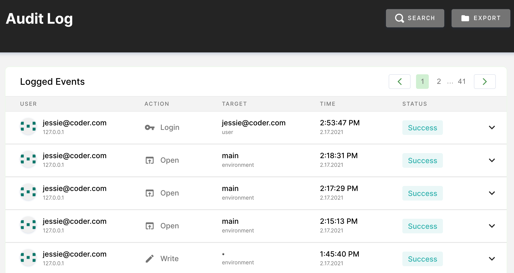

Coder maintains records of all user actions on system resources for auditing
purposes.

Any user who is a **Site Manager** or an **Auditor** can log into Coder, go to
**Manage** > **Audit**, and view the **Audit Logs**.

By default, this page displays a chronological list of all actions taken on the
system.

You can filter the logs displayed using the search filters available at the top:

- **Resource Type**: The resource on which the action is taken (e.g., image,
  workspace, user)
- **Action**: The action that the user took against a resource (e.g., read,
  write, create)
- **Resource Target**: The friendly name for the resource (e.g., the user with
  the email address **dev@coder.com**)
- **User**: The user who performs the action

## Actions

The audit logs capture information about the following actions (those who
[export Coder logs](../guides/admin/logging.md) will see this information under
`message.fields.audit_log.action`):

When reviewing Coder's audit logs, specifically, you will see the following
actions included:

- `auto_off`: Coder automatically turned off a workspace due to inactivity
- `auto_start`: Coder automatically turned on a workspace at the time preset by
  its owner
- `connect`: a user connected to an existing workspace
- `cordon`: a workspace provider became unavailable for new workspace creation
  requests.
- `create`: the user created a Coder entity (e.g., dev URL, image/image tag,
  workspace, etc.)
- `delete`: a user deleted a Coder entity (e.g., workspace or image)
- `enqueue`: a user added a new job to the queue (e.g., workspace build, user
  deletion, workspace deletion)
- `login`: a user logs in via basic authentication or OIDC, with Coder
  exchanging a token as a result
- `open`: a user opened a workspace using an IDE through the browser
- `ssh`: a user opened a web terminal or used SSH to access Coder
- `stop`: a user manually stopped a workspace
- `uncordon`: a workspace provider became available for new workspace creation
  requests.
- `view`: the Coder CLI used a secret
- `write`: the user made a change to a Coder entity (e.g., workspace, user,
  resource pool, etc.)
