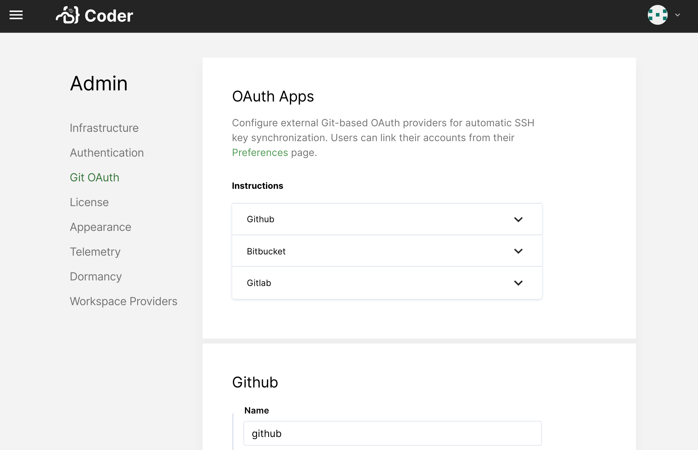

The Git Integration allows your developers to connect their Coder accounts to
their accounts with the Git repository service of choice.

## Support

Coder integrates with the following service providers for authentication and
[user key management](https://coder.com/docs/environments/preferences#linked-accounts):

- GitHub (both GitHub.com and GitHub Enterprise)
- GitLab (both GitLab.com and self-hosted GitLab)
- Bitbucket Server (_not_ Bitbucket Cloud; the Cloud API <a
  href="https://jira.atlassian.com/browse/BCLOUD-17762" target="_blank"
  rel="noreferrer noopener">doesn't support</a> managing SSH keys for users via
  OAuth)

Note that linking your Coder account with a git service provider is _not_
required. Instead, you can use Visual Studio Code with git, the command-line
tool, and we expect that this combination will work with most hosting software
or services. However, Coder doesn't test these and cannot provide
recommendations or support.

## Configuring OAuth

Before developers can link their accounts, you (or another site manager) must
create an OAuth application with the appropriate providers. When registering,
you'll be asked for the following details related to your Coder deployment.

### GitHub

When <a
href="https://developer.github.com/apps/building-oauth-apps/creating-an-oauth-app/"
target="_blank" rel="noreferrer noopener">creating an OAuth app</a>, GitHub will
ask you for the following Coder parameters:

- **Homepage URL**: Set to `[your-coder-domain]` (e.g.
  `https://coder.domain.com`)
- **User Authorization Callback URL**: Set to
  `[your-coder-domain]/oauth/callback` (e.g.
  `https://coder.domain.com/oauth/callback`)

Then, provide your **Client ID** and **Client Secret** to Coder.

When done, click **Save**.

### GitLab

When <a href="https://docs.gitlab.com/ee/integration/oauth_provider.html"
target="_blank" rel="noreferrer noopener">setting up OAuth with GitLab</a>,
you'll have to provide the following during setup:

- **Redirect URI**: Set to `[your-coder-domain]/oauth/callback` (e.g.
  `https://coder.domain.com/oauth/callback`)

You can modify the settings for your application afterward. Make sure you've
enabled the following:

- **Confidential**: Check this option
- **API** (scope): Check this option

Then, provide your **Client ID** and **Client Secret** to Coder.

When done, click **Save**.

### Bitbucket Server

On your Bitbucket Server, go to **Administration** > **Application Links**.

Create a new **Application Link**, setting the **Application URL** as
`[your-coder-domain]` (e.g. `https://coder.domain.com`). If you receive a **No
response received** error, click **Continue** to ignore it.

For your newly created Application Link, provide the following values as your
**Incoming Authentication** properties:

- **Consumer Key**: `Coder`
- **Consumer Name**: `Coder`
- **Public Key**: Your public key (available from the Coder Admin Configuration
  page)

When done, click **Save**.
