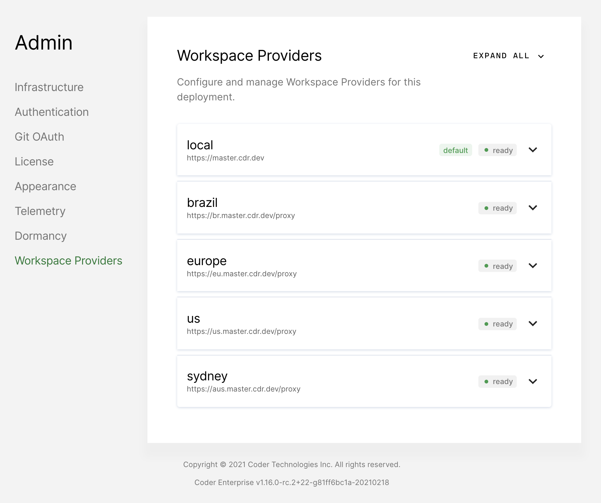

Workspace providers are logical groups of resources to which developers can
deploy workspaces. They enable a single Coder deployment to provision and manage
workspaces across multiple Kubernetes clusters and namespaces, including those
located in other geographies, regions, or clouds.

Distributed teams can use this feature to allow users to manage workspaces in
the nearest cluster. This reduces network latency and improves developers'
experience.

You can also use workspace providers to support data sovereignty requirements or
increase the isolation between workspaces running in the same region or cluster.

## Built-in workspace provider

By default, all Coder deployments will have a `built-in` workspace provider that
specifies the Kubernetes cluster containing the Coder deployment. This allows
users to create workspaces in the same cluster as the Coder deployment with no
additional configuration.

You cannot delete the `built-in` workspace provider.

## Remote workspace providers

You can deploy a workspace provider to any existing Kubernetes cluster, enabling
the cluster to become a selectable pool of resources in which developers can
create workspaces.

Remote workspace providers can lower developers' latency by locating their
workspaces closer to them geographically or can be used for workload isolation
purposes. See [Deploying a workspace provider](deployment.md) to learn how to
expand your Coder deployment to additional Kubernetes clusters.

## Admin UI

Site admins and site managers can view the workspace providers configuration
page available via **Manage** > **Admin** > **Workspace Providers**.



The Admin panel shows an overview of all configured workspace providers and
indicates their statuses and details. The **default** tag indicates the provider
that will be selected by default when a user creates a workspace using the
**Create a Workspace** dialog.

You can expand individual listings to view in-depth information:


### Status

A workspace provider can have one of the following statuses:

- **Pending**: The workspace provider has been registered but not deployed to
  the remote Kubernetes cluster.
- **Ready**: The workspace provider is online and available, and you can
  provision new workspaces to it.
- **Error**: The workspace provider encountered an issue on startup or cannot be
  reached by the Coder deployment. The workspace provider's details will include
  an error message.

### Organization allowlists

Site admins and site managers can manage which organizations have permissions to
provision new workspaces in each workspace provider. When a new organization is
created, it can provision workspaces into the `built-in` workspace provider by
default.

Organizations must not contain any workspaces in the workspace provider before
you remove them from a workspace provider's allowlist.

### Updating the access URL

For deployments with multiple workspace providers, you must ensure that each
provider can communicate with the Coder deployment (otherwise, you may see
downtime). If you want to change the Access URL after you've deployed workspace
providers to complement the `built-in` workspace provider, you must:

1. Ensure that the new URL resolves to the Coder deployment
1. Change the Coder Access URL via the **Manage** > **Admin** >
   **Infrastructure** page. The old URL should continue to resolve to the Coder
   deployment at this step.
1. [Redeploy each remote workspace provider](./deployment.md#upgrading-the-workspace-provider),
   making sure that you use the following flag:

```bash
  --set cemanager.accessURL=[NEW_ACCESS_URL]
```

1. Confirm that the remote workspace providers deployed successfully with the
   new access URL and workspaces still accessible.
1. Remove any DNS records resolving to the old access URL.

### Workspace provider lifecycle

You can create and delete workspace providers via the Coder CLI.

Helm will apply any configuration changes you make to the workspace provider
details whenever the workspace provider is deployed and updated.

For more information, see [Deploying a workspace provider](deployment.md).
