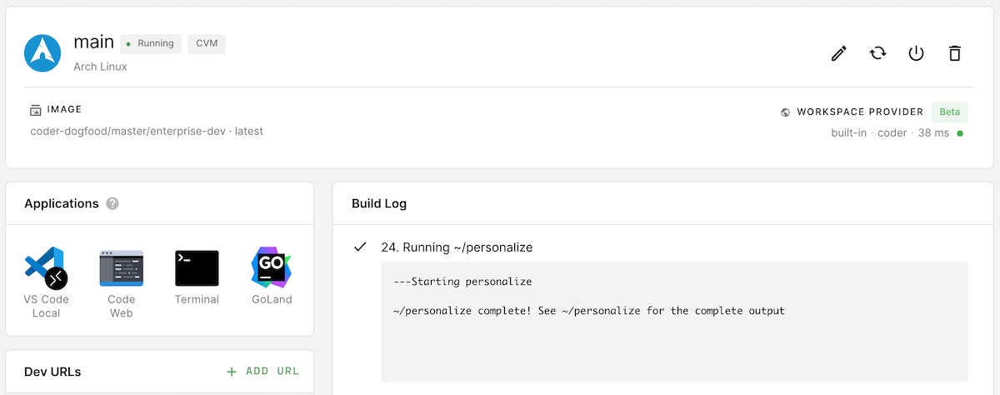

Your Coder development environment strikes a balance between consistent team
configuration and personal customization. The environment's
[image](../images/index.md) standardizes the system dependencies for
development, but there are several different mechanisms that Coder offers to
allow you to customize the environment.

## Persistent Home

The `/home/<username>` volume is bound to your environment, and its contents
persist despite shutdowns and rebuilds. This ensures that personal configuration
files like `~/.gitconfig` and `~/.zshrc`, source code, and project files, are
not disrupted.

The environment's [Image](../images/index.md), however, provides all data
outside `/home/<username>` and is reset whenever your environment
[rebuilds](./lifecycle.md).

## ~/personalize

If you want to configure your system files, Coder environments expose the
[~/personalize rebuild hook](./lifecycle.md#hooks). Coder executes the
`~/personalize` script every time Coder rebuilds the environment.

For example, if you want to use the `fish` shell as your default but your
environment's image doesn't include it, you can include installation
instructions in your `~/personalize` script. Whenever Coder rebuilds your
environment, it runs your `~/personalize` script, installs `fish`, and changes
the default shell.

```bash
#!/bin/bash

echo "--Starting personalize"

sudo apt-get update
sudo apt-get install -y fish
sudo chsh -s /usr/bin/fish $USER
```

The following is a more extensive example of a `~/personalize` script:

```bash
#!/bin/bash

###########################################################################
# For use with an environment build using an image that includes git. This
# script configures git using Coder's personalize script. This script runs
# each time the environment is rebuilt. The script must be located at
# ~/personalize. The initial environment will not contain this script, so
# it must be added after creation.
###########################################################################

# Backup existing gitconfig if it exists
if [ -f ~/.gitconfig ]; then
echo "Backing up ~/.gitconfig"
mv ~/.gitconfig ~/.gitconfig.bak
fi

# Set name and email in git
echo "[user]\n\temail = youremailhere@gmail.com\n\tname = Your Name" > ~/.gitconfig
```

### Notes

- *The `-y` flag is required to continue through any prompts. Otherwise, the
  `~/personalize` script will abort.
- The personalize script must be executable; if you create your script, you may
  need to run `chmod +x ~/personalize` to give the script execute permissions.
- When you create a new personalize file or edit an existing file, your changes
  won't take effect until you either:

  - Run ~/personalize using the Coder terminal
  - Rebuild your environment

The Environments page shows the log output of the `~/personalize` script in the
build log whenever it runs:


## Git Integration

Once your site manager has [set up a Git service](../admin/git.md), you can
[link your Coder account](preferences.md#linked-accounts). This will
authenticate all `git` operations performed in your environment.

## Dotfiles Repo

A **dotfiles repository** is a Git repository that contains your personal
environment preferences in the form of static files and setup scripts.

We recommend configuring a dotfiles repo (which Coder then clones to your home
directory) to ensure that your preferences are applied whenever you create your
environment or turn it on.

At startup, Coder clones your dotfiles repository into `~/dotfiles`. If there's
an executable `~/dotfiles/install.sh` present, Coder executes it. If not, all
dot-prefixed files are symlinked to your home directory.

Read more about dotfiles repos [here](http://dotfiles.github.io/).

### Adding Your Dotfiles Repo to Coder

You can provide a link to your dotfiles repo that's hosted with the Git provider
of your choice under [User Preferences](preferences.md):


