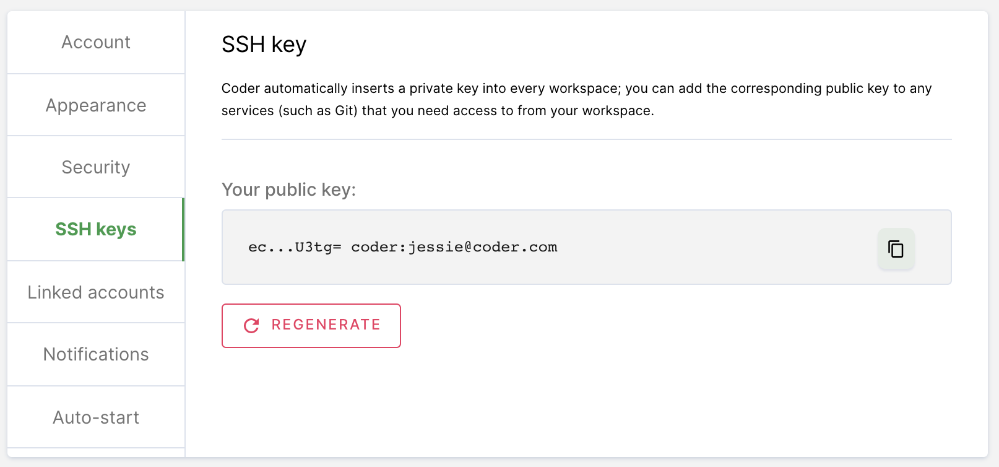
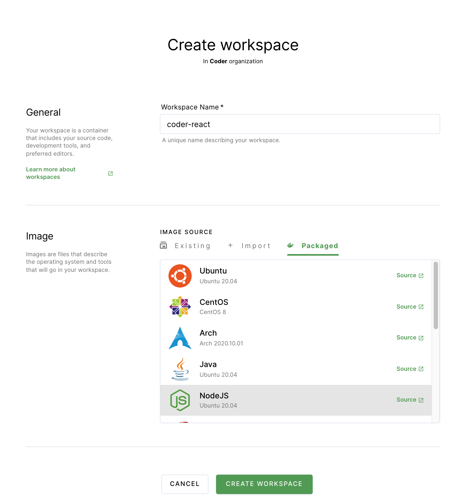
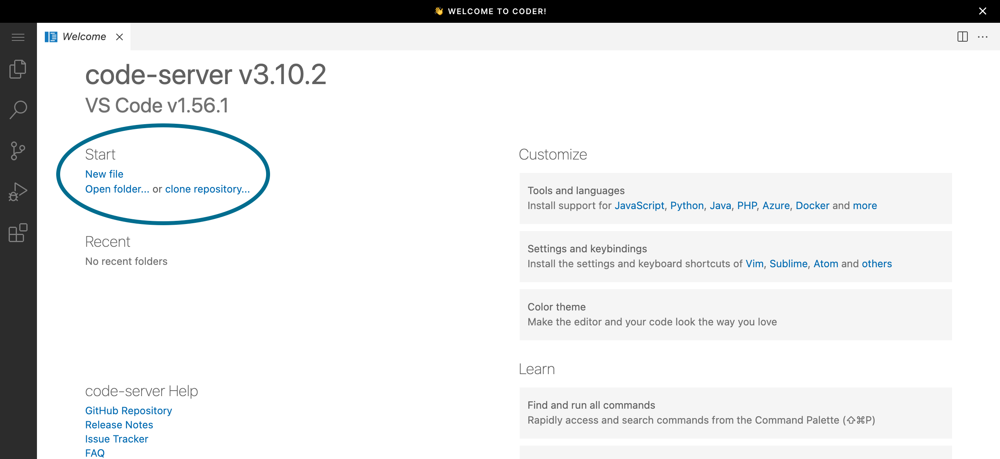
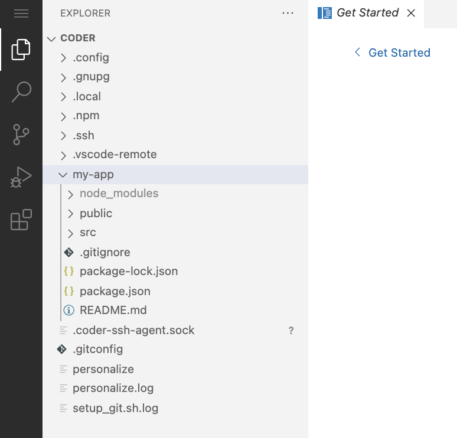
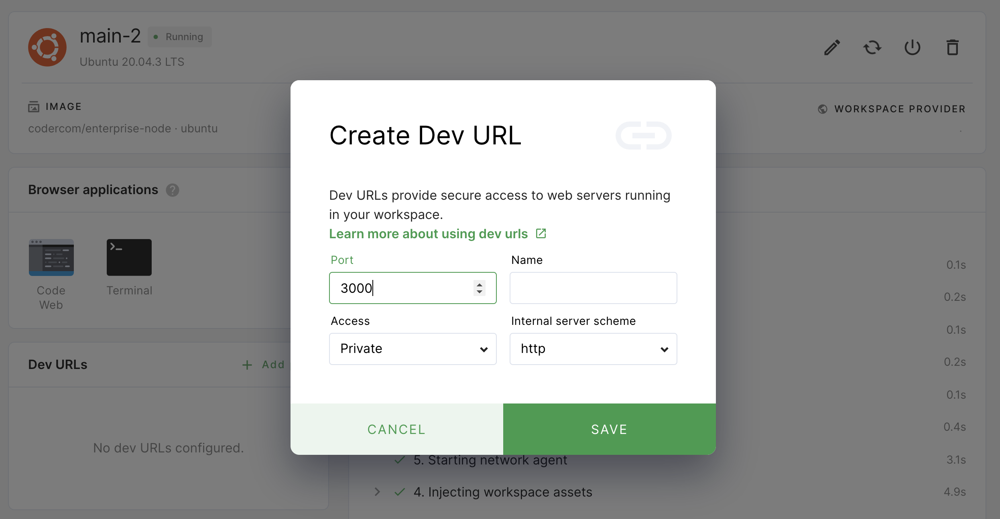
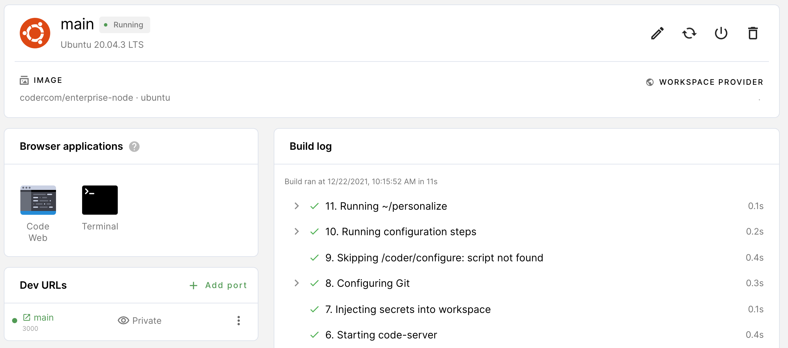
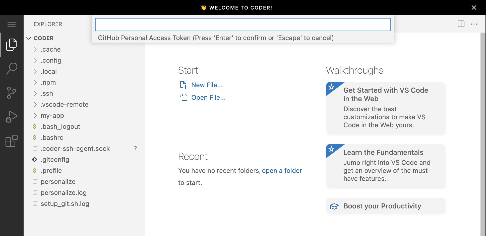

This tutorial shows you how to create a Coder development workspace and getting
set up to work on a web development project requiring Node.js and React.js.
You'll learn how to:

- Connect Coder to your Git provider;
- Create a workspace;
- Add [Create React App](https://create-react-app.dev/) to your workspace, which
  will allow you to create a sample single-page application that you can modify;
- Create a dev URL and preview changes to your project;
- Push your changes to a GitHub repo.

## Prerequisites

Please [install Coder for Docker](../setup/docker.md) before proceeding.

## Step 1: Log in and connect Coder to your Git provider

In this step, you'll log into Coder and connect and authenticate with your Git
provider. This will allow you to do things like pull repositories and push
changes.

1. Navigate to the Coder deployment using the URL provided to you during the
   Coder for Docker installation process, and log in.

1. Click on your avatar in the top-right, and select **Account**.

   

1. Provide Coder with your SSH key to connect and authenticate to GitHub.

   Go to **SSH keys**. Copy your public SSH key and
   [provide it to GitHub](https://docs.github.com/en/authentication/connecting-to-github-with-ssh/adding-a-new-ssh-key-to-your-github-account).

   

## Step 2: Create your workspace

You will now create the workspace where you'll work on your development project.

1. Return to **Workspaces** using the top navigation bar.

1. Click **New workspace** to launch the workspace-creation dialog.

1. Provide a **Workspace Name**.

1. In the **Image** section, click **Packaged** (this tab contains
   Coder-provided images hosted in a Docker registry). Select **NodeJS**. This
   will populate the form in the **Import** tab.

1. Under **Workspace providers**, leave the default option (which is **Docker**)
   selected.

1. Scroll to the bottom, and click **Create workspace**. The dialog will close,
   allowing you to see the main workspace page. You can track the workspace
   build process using the **Build log** on the right-hand side.



Once your workspace is ready for use, you'll see a chip that says **Running**
next to the name of your workspace.

## Step 3: Add a sample project to your workspace

Once you've created your workspace, you can start using Coder after adding a
sample project to your workspace.

1. Under **Browser applications**, click **Code Web** to open VS Code in your
   browser.

1. When VS Code launches in your browser, click **Open folder...**. In the
   prompt, you'll see `/home/coder`. This directory is where you'll clone a
   sample React app project Git repository. Click **OK** to proceed.

   

1. Click the hamburger icon in the top right, and select **Terminal** > **New
   Terminal** to open a new terminal.

1. You're now ready to create a demo app that you can modify:

   ```console
   npx create-react-app my-app
   cd my-app
   ```

   Once done, you can expand the `my-app` folder in the left-have nav bar to see
   its contents:

   

   You're now ready to make changes to the application.

## Step 4: Preview your app and view changes live

Dev URLs allow you to access the web services you're developing in your
workspace. Once you've created a dev URL, Coder listens on the port you
specified and renders a browser link you can use to view your application.

1. Return to your workspace overview page, and find the **Dev URLs** section.

1. Click **Add port**.

1. Provide a **Name** for your port, and leave the remaining fields as-is. Click
   **Save**.

   

1. At this point, you can build and run the sample app by returning to your Code
   Web window and running the following in the terminal:

   ```console
    npm start
   ```

1. From the workspace overview, launch your dev URL by clicking its name; Coder
   will open a new browser window and point you to the appropriate URL.

   

1. You can test preview by making changes to the `src/App.js` file; every time
   you save your changes to this file and refresh your browser window, your
   preview will update.

   

## Step 5: Push your repo to GitHub

The follow steps show you how to push your app to a newly created GitHub repo.

1. Log in to GitHub and navigate to
   [Create a new repository](https://github.com/new).

1. Provide a **repository name** and click **Create repository**.

1. Return to your workspace, run the following in your terminal to add a remote
   to your GitHub repo, change the primary branch name to `main`, and push the
   contents to your newly created repo:

   ```console
   git remote add origin https://github.com/<username>/<repoName>.git
   git branch -M main
   git push origin main
   ```

1. Next, Code Web will display an alert that says the GitHub extension wants to
   sign in; click **Allow** to proceed.

1. Within the IDE window (near the top), you'll be prompted to provide your
   GitHub Personal Access token

   ]

   At this point, the contents of your repo should be pushed to GitHub.
