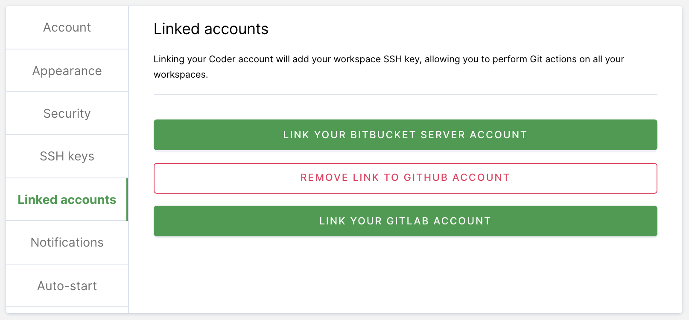
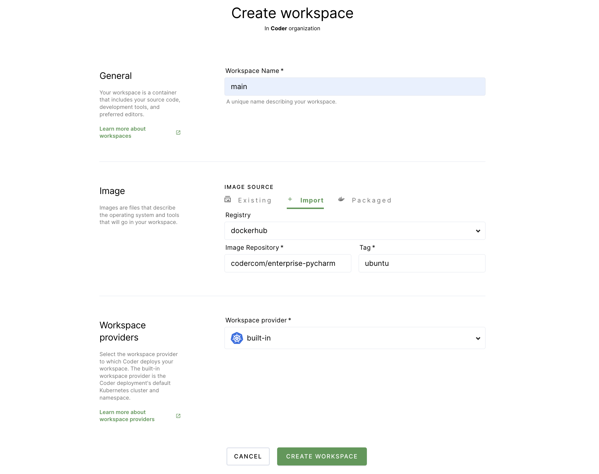

This article will walk you through the process of getting started with a Coder
workspace and a project that leverages PyCharm. You'll learn how to:

- Connect Coder to your Git provider;
- Create a workspace;
- Create your first Python project;
- Push your changes to GitHub.

## Prerequisites

This guide assumes that you have a Coder deployment available to you and that
you have the credentials needed to access the deployment.

## Step 1: Log in and connect Coder to your Git provider

In this step, you'll log into Coder and connect and authenticate with your Git
provider. This will allow you to do things like pull repositories and push
changes.

1. Navigate to the Coder deployment using the URL provided to you by your site
   manager, and log in.

1. Click on your avatar in the top-right, and select **Account**.

   

1. Provide Coder with your SSH key to connect and authenticate to GitHub.

   If your site manager has configured OAuth, go to **Linked Accounts** and
   follow the on-screen instructions to link your GitHub account.

   

   If your site manager has _not_ configured OAuth, go to **SSH keys**. Copy
   your public SSH key and
   [provide it to GitHub](https://docs.github.com/en/authentication/connecting-to-github-with-ssh/adding-a-new-ssh-key-to-your-github-account).

   

## Step 2: Create your workspace

You will now create the workspace to work on your development project.

1. Return to **Workspaces** using the top navigation bar.

1. Click **New workspace** to launch the workspace-creation dialog.

1. Provide a **Workspace Name**.

1. In the **Image** section, click **Packaged** (this tab contains
   Coder-provided images hosted in a Docker registry). Select **PyCharm**. This
   will populate the form in the **Import** tab.

1. Under **Workspace providers**, leave the default option (which is
   **built-in**) selected.

1. Expand the **Advanced** section. If the **Run as a container-based virtual
   machine** option is selected, _unselect_ the box. Leave the **CPU**,
   **Memory**, **Disk**, and **GPU** allocations as-is.

1. Scroll to the bottom and click **Create workspace**. The dialog will close,
   allowing you to see the main workspace page. On the right-hand side, you can
   track the workspace build process using the **Build log**.



Once your workspace is ready for use, you'll see a chip that says **Running**
next to the name of your workspace.

## Step 3: Create a sample project file in your workspace

Once you've created your workspace, you can start working in Coder. For the
purposes of this article, we'll leverage JetBrains' tutorial on how to
[Create and run your first Python project](https://www.jetbrains.com/help/pycharm/creating-and-running-your-first-python-project.html).

1. Under **Browser applications**, click **PyCharm Community** to open the IDE
   in your browser. Follow the prompts to accept the license agreement and
   determine data sharing permissions.

1. On the **Welcome to PyCharm** screen, click **New Project**.

1. In the window that pops up:

   1. Provide the **Location** where PyCharm should save your files (for this
      example, we changed the highlighted portion to `task`, but you can name
      the folder whatever you'd like))
   1. Ensure that **New environment using Virtualenv** is selected.
   1. Make sure to **uncheck** the option to **Create a main.py welcome
      script**.
   1. Click **Create** to proceed.

1. In the left-hand navigation bar, right-click on the **root** of your folder
   (for example, if you named the folder `task`, you would click where it says
   **task** in the navbar) and select **New** > **File**. When prompted, provide
   a name for your file (e.g., `car.py`).

1. The IDE automatically opens your new, empty file, allowing you to edit. Copy
   and paste the following
   [sample app from JetBrains](https://www.jetbrains.com/help/pycharm/creating-and-running-your-first-python-project.html#edit-file):

   ```python
    class Car:

        def __init__(self, speed=0):
            self.speed = speed
            self.odometer = 0
            self.time = 0

        def say_state(self):
            print("I'm going {} kph!".format(self.speed))

        def accelerate(self):
            self.speed += 5

        def brake(self):
            if self.speed < 5:
                self.speed = 0
            else:
                self.speed -= 5

        def step(self):
            self.odometer += self.speed
            self.time += 1

        def average_speed(self):
            if self.time != 0:
                return self.odometer / self.time
            else:
                pass

    if __name__ == '__main__':

        my_car = Car()
        print("I'm a car!")
        while True:
            action = input("What should I do? [A]ccelerate, [B]rake, "
                    "show [O]dometer, or show average [S]peed? ").upper()
            if action not in "ABOS" or len(action) != 1:
                print("I don't know how to do that")
                continue
            if action == 'A':
                my_car.accelerate()
            elif action == 'B':
                my_car.brake()
            elif action == 'O':
                print("The car has driven {} kilometers".format(my_car.odometer))
            elif action == 'S':
                print("The car's average speed was {} kph".format(my_car.average_speed()))
            my_car.step()
            my_car.say_state()
   ```

1. At this point, you can run your application by right-clicking on the IDE
   editor window and selecting **Run <fileName>**. Once the app starts, you can
   interact with it using the terminal at the bottom.

## Step 5: Push your repo to GitHub

The following steps show you how to push your app to a newly created GitHub
repo.

1. Log in to GitHub and navigate to
   [Create a new repository](https://github.com/new).

1. Provide a **repository name** and click **Create repository**.

1. Return to your workspace, and click **Terminal** at the bottom.

1. Run the following to turn your directory into a Git repository and commit
   your initial changes:

   ```console
   cd ..
   git init <nameOfDirectory>
   cd <nameOfDirectory>
   git add -A
   git commit -am "Initial commit"
   ```

1. Run the following in your terminal to add a remote to your GitHub repo,
   change the primary branch name to `main`, and push the contents to your newly
   created repo:

   ```console
   git remote add origin git@github.com:<username>/<repoName>.git
   git branch -M main
   git push origin main
   ```

1. Within the IDE window (near the top), you'll be prompted to log in to GitHub
   by providing your username and password/personal access token.

1. Next, Code Web will display an alert that says the GitHub extension wants to
   sign in; click **Allow** to proceed.

1. In the subsequent window, click **Continue** to authorize Visual Studio Code
   to access GitHub.

   At this point, the contents of your repo should be pushed to GitHub.
