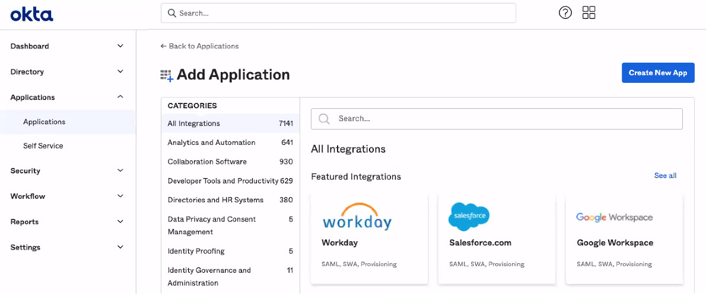
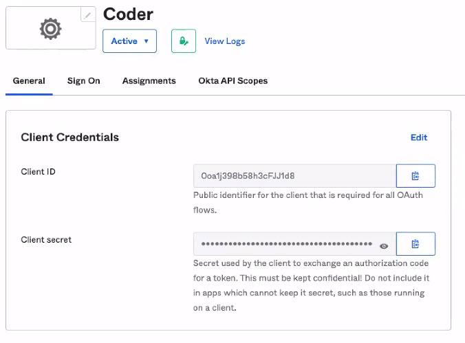
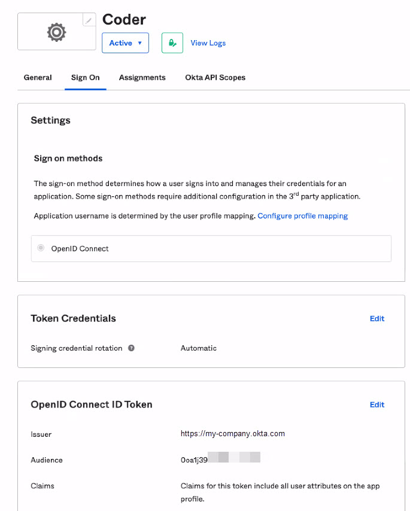
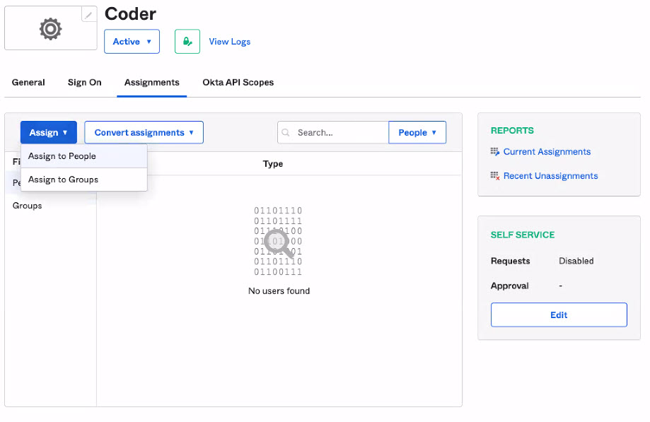

This article walks you through setting up single sign-on to Coder using Okta.

Configuring [Coder's OpenID
Connect](../../admin/access-control/index.md#openid-connect) feature requires
you to provide three pieces of information from Okta:

- Client ID
- Client Secret
- Issuer

This guide will show you how to set up an app on Okta and obtain the information
you need to provide to Coder.

## Step 1: Register your app with Okta

1. Log in to your Okta org (`<my-company>.okta.com`) as an admin.
1. From the admin dashboard, go to **Applications** and select the
   **Applications** sub-menu.

1. Click **Add Application**.

   

1. Click **Create New App**.

   

1. Select **OpenID Connect** and click **Create**

   

1. Provide an **Application name** (i.e., `Coder`), (optionally) add a logo, and
   add the **Login redirect URIs** for Coder (it will be formatted similarly to
   `https://coder.my-company.com/oidc/callback`).

   

1. Click **Save** to proceed.

When Okta has created your app, you'll be redirected to the **General** tab,
which displays your app information.

## Step 2: Gather your Okta app information

Once you've saved your app, you can obtain your:

- Client ID
- Client Secret
- Issuer

### Client ID and Client Secret

On your application's **General** tab, look for the **Client Credentials**
section, which includes the **Client secret**.

### Issuer

On your app's **Overview** page, click the **Sign On** tab. Find the **OpenID
Connect ID Token** section, and copy the **Issuer**.

## Step 3: Assign People and Groups to Coder

On your app's **Overview** page, click the **Assignments** tab. Under
**Assign**, you can choose to **Assign to People** or **Assign to Group** to
provide users and groups access to Coder.

## Step 4: Configure Coder authentication

Once you've saved your Okta values, you can complete the remaining steps using
the Coder UI.

1. Log in to Coder, and go to **Manage** > **Admin** > **Authentication**.
1. In the top-most drop-down box, select **OpenID Connect**.
1. Provide the requested values for **Client ID**, **Client Secret**, and
   **Issuer**.

When done, click **Save Preferences**.

At this point, Coder validates your configuration before proceeding. If
successful, Coder will send OIDC login attempts to Okta.
