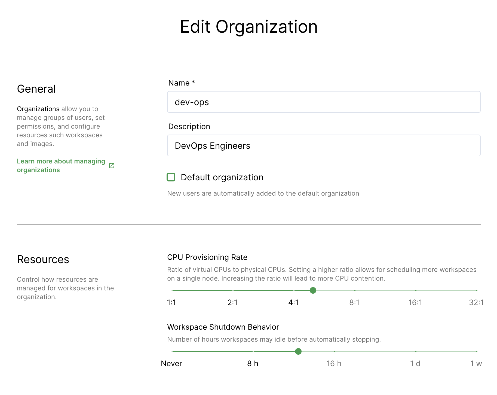

The computing workloads of developers are unique in that they don't require
consistent access to CPUs; instead, developers typically have short periods of
peak usage during builds and compilation followed by long periods of low usage.

Build and compilation performance directly impacts the development experience of
a project: faster builds mean faster iteration cycles, leading to greater
development velocity. However, traditional approaches to providing developers
with more hardware for computationally intensive compilations can lead to wasted
resources.

## Individual vs. Shared Resources

Consider a project whose compilation is parallelizable up to 16 CPU cores.

Because each developer would need hardware capable of supporting compilation,
you could give everyone laptops with 16 CPU cores. During compilation and build,
each machine would see 100% utilization of its resources. However, these
processes are relatively quick, so the machine is underutilized the vast
majority of the time.

However, sharing resources can allow you to provide your developers with access
to the computing resources while minimizing underutilization.

Coder places each developer into an isolated environment and schedules each
developer's environment onto the same piece of hardware (in this example, the
hardware is a machine with 16 CPU cores). Each developer has access to the
resources they need during peak load (e.g., compilation, build); this offers
them a performant experience when required. However, the shared resources
minimize resource underutilization.

## Resource Contention

One possible issue with shared resources is resource contention.

If the resources on the underlying node become contented, the developers will
share CPU cycles on a weighted basis relative to the resource request of the
Coder environment.

However, the nature of developer workflows makes resource contention fairly
uncommon since this occurs when several users are performing resource-intensive
tasks, such as compilation, simultaneously.

## Shared Resource Configuration in Coder

Five variables determine how resource allocation and usage affect developers and
compute costs:

- The Kubernetes Node type (virtual CPU count and memory size)
- The Coder environment's default CPU and memory limits
- The Coder organization's CPU and memory provision ratios
- The Coder organization's environment inactivity shutdown threshold
- The magnitude and frequency of code compilation operations

