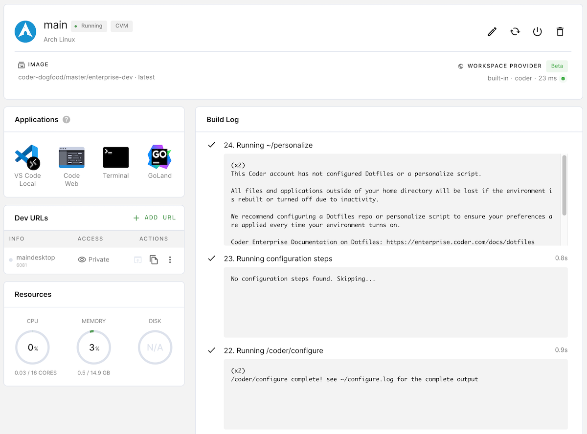

If you have configuration instructions that apply to everyone who uses a given
image to create environments, you can define them using the **/coder/configure**
file.

For example, you might want all of the image's users to check for the presence
of the project's Git repo (and if it's not there, clone it).

Coder will check the image for the presence of a **/coder/configure** file
during the build process; if Coder finds one, it will execute the instructions
contained.

The following steps will show you how to create and use a config file.

Step 1: Create the Configure File

Using the text editor of your choice, create a file named `configure` and add
the instructions that you want included. For example, the following
file shows how you can clone a repo at build time:

```bash
#!/bin/bash
if [ ! -d "/home/coder/workspace/project" ]
then
git clone git://company.com/project.git /home/coder/workspace/project
else
echo "Project has already been cloned."
fi
```

Note that the instructions provided include logic on whether the instructions
should be re-run (and when) or if Coder should run the instructions only once.
We strongly recommend including this logic at all times to minimize overhead.

Step 2: Add the Configure File to the Image

Once you have a config file, update your image to use it by including the
following in your Dockerfile:

```dockerfile
COPY [ "configure", "/coder/configure" ]
```

As an example, take a look at the sample Docker file that follows; the final
line includes instructions to Coder on copying the settings from the configure
file:

```dockerfile
FROM ubuntu:latest
RUN apt-get update && apt-get install -y curl
COPY [ "configure", "/coder/configure" ]
```

Step 3: Build and Push the Image and Config File

To make your image accessible to Coder, build the development image and push it
to the Docker registry.

To build your image, run the following command in the directory where your
Dockerfile is located (be sure to replace the cdr/config placeholder value with
your tag and repository name so that the image is pushed to the appropriate
location):

```bash
docker build cdr/config .
```

Once you've built the image, push the image to the Docker registry:

```bash
docker push cdr/config
```

Step 4: Test the Config File

You can test your setup by performing the following steps:

1. [Importing your image](importing.md)
2. [Creating your environment using the newly imported
   image](../environments/getting-started.md)

Coder will run the configure file during the build process, and you can verify
this using the Environment Overview page (Coder runs the configure file as the
penultimate step of the build process):


