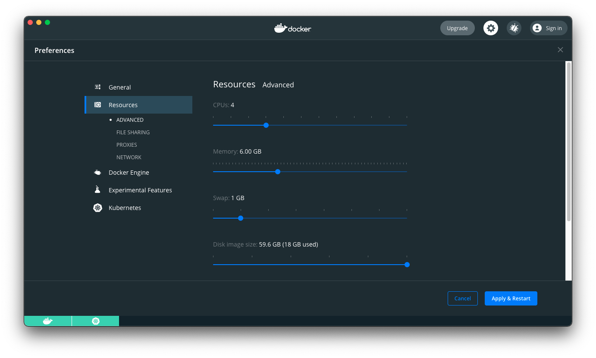

Coder is typically deployed to a remote data center, but you can use
[Docker][docker-url] to create a lightweight preview deployment of Coder.

> Coder currently supports local preview only on workstations running macOS or
> Linux.

Coder automatically uploads a single-seat license upon installation.

## Prerequisites

Before proceeding, please make sure that you have the following installed:

1. [Docker](https://hub.docker.com/search?q=docker&type=edition&offering=community)
1. [helm](https://helm.sh/docs/intro/install)
1. [kind](https://kind.sigs.k8s.io/docs/user/quick-start/#installation) or
   [Docker Desktop](docker-desktop-url)
1. [kubectl](https://kubernetes.io/docs/tasks/tools/install-kubectl)

## Limitations

**We do not recommend using local previews for production deployments of Coder.**

### Resource allocation and performance

Your experience with the local Coder preview is dependent on your system specs,
but please note that you can expect slightly degraded performance due to the
deployment running entirely inside a Docker container.

### CVMs

The kind deployment supports [CVMs][cvm-url] if you meet the following
requirements (if you choose not to try out CVMs, these requirements do not
apply):

1. Your Linux hosts must be running Linux Kernel 5 and above.

1. You must have the `linux-headers` package corresponding to your Kernel
   version installed. You should see the following folders all corresponding to
   your Kernel version:

   ```console
   $ uname -r
   5.11.4-arch1-1
   $ ls /usr/lib/modules
   5.11.4-arch1-1
   $ ls /usr/src/
   linux  linux-headers-5.11.4-arch1-1
   ```

1. Docker Desktop for Mac **must** use version [2.5.0.1][docker-mac-url]. This
   specific version is required because of a recent downgrade to Linux Kernel
   4.9 due to a [bug](docker-bug-url).

### Dev URLs

Currently, the local preview doesn't support [dev URLs][devurl-url]. Instead,
you can use tools like [ngrok][ngrok-url] to preview webpages from inside an
workspace.

We are working on bringing Dev URL support to local previews in later releases.

### SSH

When using kind for your local preview, SSH is not configured to run by default.

When using Docker Desktop for your local preview, SSH works as long as your
machine does not have an existing SSH server running on port `22`.

### Air-gapped clusters

The local preview option does not work in an air-gapped deployment.

## Option 1: Kind

To install Coder, run:

```console
curl -fsSL https://coder.com/try.sh | PORT="8080" sh -s --
```

> Note: you can edit the value of `PORT` to control where the Coder dashboard
> will be available.

When the installation process completes, you'll see the URL and login
credentials you need to access Coder:

```txt
You can now access Coder at

    http://localhost:8080

You can tear down the deployment with

    curl -fsSL https://coder.com/try.sh | sh -s -- down

Platform credentials
User:     admin
Password: yfu...yu2
```

Visit the URL, and log in using the provided credentials. The platform is
automatically configured for you, so there's no first-time setup to do.

## Option 2: Docker Desktop

[Docker Desktop](docker-desktop-url) includes a standalone Kubernetes server and
client that you can use to run Coder.

1. [Enable the Kubernetes cluster](docker-k8s-docs) inside Docker.

1. Ensure that Docker has enough resources allocated to meet
   [Coder's requirements](https://coder.com/docs/coder/v1.20/setup/requirements)
   (you can do so by going to Docker preferences).

   

1. Install [metrics-server](https://github.com/kubernetes-sigs/metrics-server)
   so that Coder gets valid metrics from your cluster:

   ```console
   helm repo add bitnami https://charts.bitnami.com/bitnami
   ```

1. [Install Coder](../installation) on to your cluster.

If you run into `OutOfmemory` errors when installing, try increasing your
resource allocation in Docker. If increasing the resource allocation doesn't fix
the error, reinstall Coder using the following Helm values:

```console
helm upgrade --install coder \
    --set ingress.useDefault=false \
    --set cemanager.resources.requests.cpu="0m" \
    --set cemanager.resources.requests.memory="0Mi" \
    --set envproxy.resources.requests.cpu="0m" \
    --set envproxy.resources.requests.memory="0Mi" \
    --set timescale.resources.requests.cpu="0m" \
    --set timescale.resources.requests.memory="0Mi" \
    coder/coder
```

## Removing Coder

To remove the local Coder deployment, run:

```console
curl -fsSL https://coder.com/try.sh | sh -s -- down
```

Because Coder runs inside Docker, you should have nothing left on your machine
after tear down.

[docker-url]: https://www.docker.com/
[docker-desktop-url]: https://www.docker.com/products/docker-desktop
[docker-k8s-docs]: https://docs.docker.com/desktop/kubernetes/
[kind-url]: https://kind.sigs.k8s.io/
[cvm-url]: https://coder.com/docs/workspaces/cvms
[docker-mac-url]:
  https://docs.docker.com/docker-for-mac/release-notes/#docker-desktop-community-2501
[docker-windows-url]:
  https://docs.docker.com/docker-for-windows/release-notes/#docker-desktop-community-2501
[docker-bug-url]: https://github.com/docker/for-mac/issues/5044
[ngrok-url]: https://ngrok.com
[devurl-url]: https://coder.com/docs/workspaces/devurls
