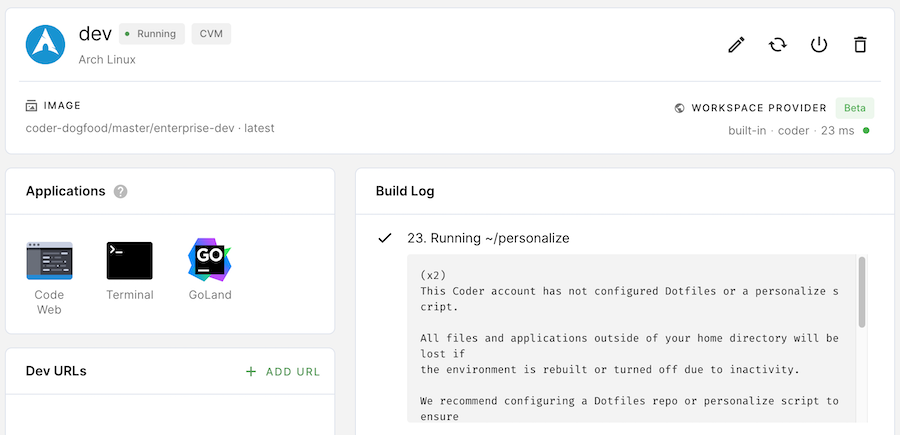

Your Coder development workspace strikes a balance between consistent team
configuration and personal customization. The workspace's
[image](../images/index.md) standardizes the system dependencies for
development, but there are several different mechanisms that Coder offers for
customizing the workspace.

## Persistent home

The `/home/<username>` volume is bound to your workspace, and its contents
persist despite shutdowns and rebuilds. This ensures that personal configuration
files like `~/.gitconfig` and `~/.zshrc`, source code, and project files, are
not disrupted.

The workspace's [image](../images/index.md), however, provides all data outside
`/home/<username>` and is reset whenever your workspace
[rebuilds](./lifecycle.md).

## ~/personalize

If you want to configure your system files, Coder workspaces expose the
[~/personalize rebuild hook](./lifecycle.md#hooks). Coder executes the
`~/personalize` script every time Coder rebuilds the workspace.

For example, if you want to use the `fish` shell as your default, but your
workspace's image doesn't include it, you can have installation instructions in
your `~/personalize` script. Whenever Coder rebuilds your workspace, it runs
your `~/personalize` script, installs `fish`, and changes the default shell.

```console
#!/bin/bash

echo "--Starting personalize"

sudo apt-get update
sudo apt-get install -y fish
sudo chsh -s /usr/bin/fish $USER
```

The following is a more extensive example of a `~/personalize` script:

```console
#!/bin/bash

#
# For use with a workspace build using an image that includes git. This
# script configures git using Coder's personalize script. This script runs
# each time the workspace is rebuilt. The script must be located at
# ~/personalize. The initial workspace will not contain this script, so
# it must be added after creation.
#

# Backup existing gitconfig if it exists
if [ -f ~/.gitconfig ]; then
echo "Backing up ~/.gitconfig"
mv ~/.gitconfig ~/.gitconfig.bak
fi

# Set name and email in git
echo "[user]\n\temail = youremailhere@gmail.com\n\tname = Your Name" > ~/.gitconfig
```

### Notes

- \*The `-y` flag is required to continue through any prompts. Otherwise, the
  `~/personalize` script will abort.
- The personalize script must be executable; if you create your script, you may
  need to run `chmod +x ~/personalize` to give the script execute permissions.
- When you create a new personalize file or edit an existing file, your changes
  won't take effect until you either:

  - Run ~/personalize using the Coder terminal
  - Rebuild your workspace

The Workspaces page shows the log output of the `~/personalize` script in the
build log whenever it runs:



## Git integration

Once your site manager has [set up a Git service](../admin/git.md), you can
[link your Coder account](preferences.md#linked-accounts). This will
authenticate all `git` operations performed in your workspace.

## Dotfiles repo

A **dotfiles repository** is a Git repository that contains your personal
workspace preferences in the form of static files and setup scripts.

We recommend configuring a dotfiles repo (which Coder then clones to your home
directory) to ensure that your preferences are applied whenever you create your
workspace or turn it on.

At startup, Coder clones your dotfiles repository into `~/dotfiles`. If there's
an executable `~/dotfiles/install.sh` present, Coder executes it. If not, all
dot-prefixed files are symlinked to your home directory.

> You **must** mark `install.sh` as executable before committing it to your
> dotfiles repo.

Read more about dotfiles repos [here](http://dotfiles.github.io/).

### Adding your dotfiles repo to Coder

You can provide a link to your dotfiles repo that's hosted with the Git provider
of your choice under [User preferences](preferences.md):


### Setting environment variables

If you'd like to set environment variables in your workspace so that they're
available to Code Web (VS Code) running in your workspace and persist across
workspace builds, you can do so by:

1. Setting the environment variables in `.profile`;
1. Including `.profile` in the dotfiles repo you're using with Coder.

Code Web will access the environment variables you set when you launch the IDE.
