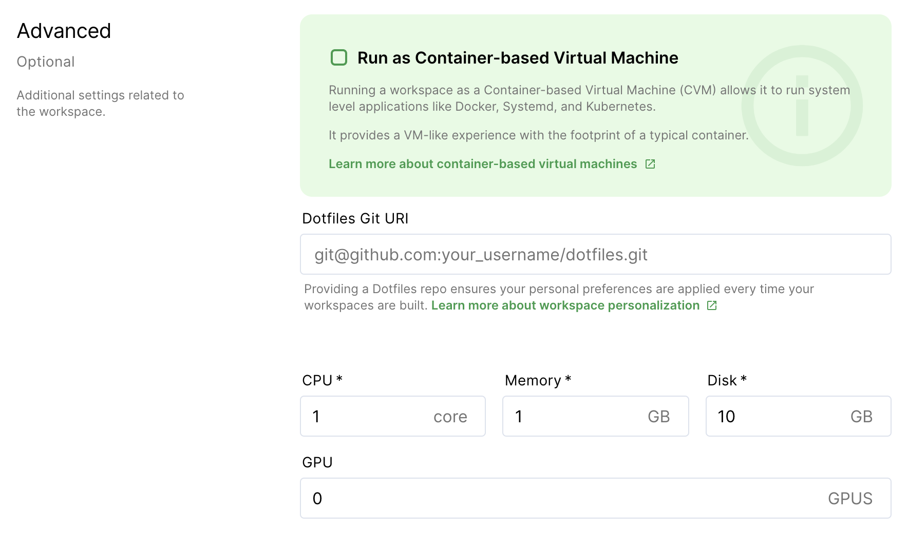

Whenever you log into Coder, you'll see the **Workspace** page.

If this is your first time using Coder, you'll see a **Create Workspace** button
in the middle of your screen; otherwise, you'll see a list of your existing
workspaces.

To create a workspace, launch the creation dialog by clicking **New Workspace**
in the top-right. If you'd like to create a new workspace based on a
[template](workspace-templates/index.md), click the drop-down arrow next to
**New Workspace** and select **New workspace from template**.

When prompted, provide the following information:

<table>
    <tr>
        <td><b>Workspace name</b></td>
        <td>A friendly name for your workspace</td>
    </tr>
    <tr>
        <td><b>Image source</b></td>
        <td>The source of your image; leave as <b>Existing</b> in most cases.
        You can also <b>import</b> a new image if your site manager has imported
            a <a href="../admin/registries/index.md">registry</a> or select a <b><a
            href="https://github.com/cdr/enterprise-images">packaged</
            a></b> image provided by Coder if your site manager has
            enabled the automatic importing of the <a
            href="../admin/registries/default-registry.md">Default Registry</a>.
        </td>
    </tr>
    <tr>
        <td><b>Image</b></td>
        <td>The Docker image you want to use as the base for your workspace</td>
    </tr>
    <tr>
        <td><b>Tag</b></td>
        <td>The version of the image you want to use</td>
    </tr>
    <tr>
        <td><b>Workspace provider</b></td>
        <td>The Kubernetes cluster to which your workspace will be deployed.
        Default: <code>built-in</code></td>
    </tr>
</table>

Coder offers several **advanced** settings that allow you to customize your
workspace. You can choose to run your workspace as a container-based virtual
machine, provide a dotfiles URI for [personalization](personalization.md), and
set your resource allocation.

<table>
    <tr>
        <td><b>Run as container-based virtual machine</b></td>
        <td>Enable this to allow the running of system-level applications like
        Docker, Systemd, and Kubernetes; this provides a VM-like experience with
        the footprint of a container</td>
    </tr>
    <tr>
        <td><b>Dotfiles Git URI</b></td>
        <td>The link to your Dotfiles repo; Coder will apply the settings
        prescribed every time your workspace rebuilds</td>
    </tr>
    <tr>
        <td><b>CPU cores</b></td>
        <td>The number of CPU cores you'd like for your workspace</td>
    </tr>
    <tr>
        <td><b>Memory</b></td>
        <td>The amount of memory you'd like for your workspace</td>
    </tr>
    <tr>
        <td><b>Disk</b></td>
        <td>The amount of storage space you'd like for your workspace</td>
    </tr>
    <tr>
        <td><b>GPU</b></td>
        <td>The number of
        <a href="../admin/workspace-management/gpu-acceleration.md">GPUs</a>
        you want allocated to your workspace</td>
    </tr>
    <tr>
        <td><b>Auto-start</b></td>
        <td>Whether you want your workspace to turn on automatically at a
        specific time (you can set the auto-start time in User Preferences.</td>
    </tr>
</table>

By default, Coder allocates resources (CPU cores, memory, and disk space) based
on the parent image. You can modify these starting values, though the maximum
number of CPU cores, amount of memory, and allocation of disk space you can
request for your workspace are determined by the Coder
[site manager on an organization level](../admin/organizations/index.md#create-a-new-organization).

Coder displays a warning if you choose your resource settings and they're less
than the image-recommended default, but you can still create the workspace.

When you're done making changes, click **Create workspace** to proceed. Coder
redirects you to an overview page for your workspace during the build process.

## .gitconfig files

If the image you're using to create your workspace doesn't include a .gitconfig
file, Coder will generate one for you automatically using the details found in
your Coder account.

You can modify the .gitconfig file, but we recommend using a
[personalization](personalization.md) file to customize your workspace.
